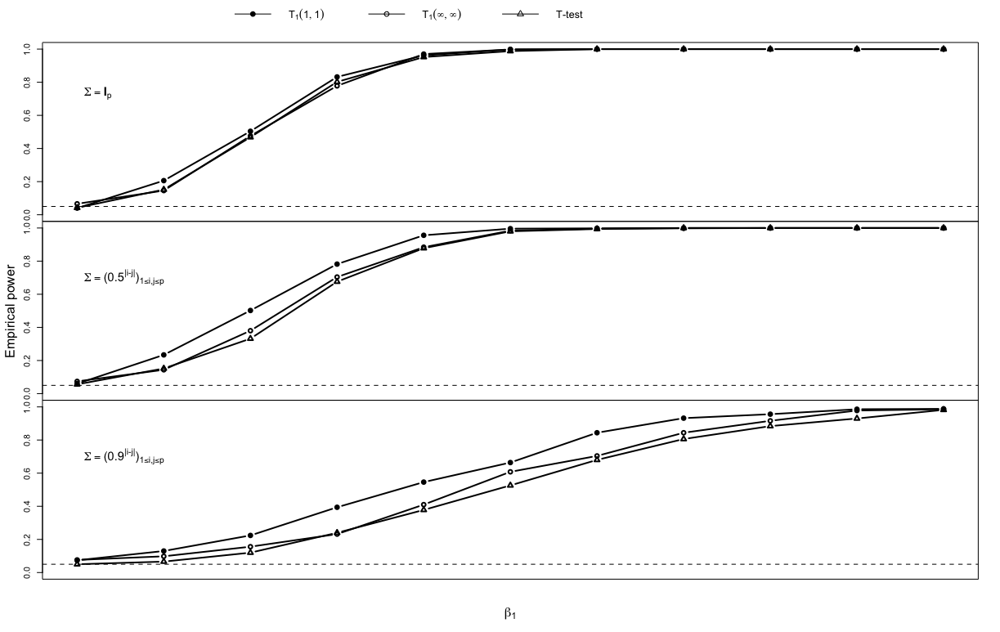

# High-Dimensional Inference based on the Leave-One-Covariate-Out LASSO path
## Cao, X, Gregory, K.B, Wang, D

This R package is for high-dimensional inference using LOCO regularization path. Allows calculating **variable/feature importance**, **variable screening** for high-dimensional regression and **statistical inference** in the high-dimensional settings. 

**Parallel computing** is supported to accelerate the inference process (on **MacOS** and **Linux**. Windows users, sorry). 

The statistical inference procedure now are for high-dimensional linear regression only. Soon, we will add tools for GLM, Cox PH model and Gaussian graphical models.  

### Install the R package

To install, please use 
```R
devtools::install_github("devcao/LOCOpath")
```

### How to use?
#### Simple example
```R
require(LOCOpath)  ## load the package
set.seed(10) ## set seed
data = depenDesign(n = 100, p = 12, beta = c(0,rep(1,2),rep(0,9)), rho = 0) ## generate some data

## calculate our test statistic for beta_1, using L1 norm
TS = ExactPath.TS(X = data$X, Y = data$Y, which.covariate = 1, betaNull = 0, multiTest = FALSE, norm = 'L1')
## calculate bootstrapped p-value for beta_1, using L1 norm 
rsmpl_rslt = Path.Resample(X = data$X, Y = data$Y, 
                           which.covariate = 1, betaNull = 0, multiTest = FALSE, norm = 'L1', 
                           B = 500, parallel = TRUE, beta.init = 'adaptive', beta.true = 0)
print(rsmpl_rslt$pval)
```
You should see the following p-value for beta_1
```R
> print(rsmpl_rslt$pval)
[1] 0.226
```

#### Power curve simulation 
Simulate power curve check the function
```R
Path.Resample.Power
```
Power curve of other method: desparsified LASSO, t-test and F-test, please check [this file](./compare_power.R)
```R
require(LOCOpath)
## model setting 
n = 100; p = 12; rho = 0
## Power: 500 iterations; Bootstrap: 500 replicates
iter = 500; B = 500
power_indep_L1 = matrix(0, 11, 4)
i = 1
for (b in seq(0,1,0.1)){
  power_indep_L1[i, ] = Path.Resample.Power(n = n, p = p, beta=c(0+b,rep(1,2),rep(0,9)), 
                                     rho=rho, iter = iter, B = B, setting = 'dep', 
                                     which.covariate = 1, betaNull = 0, multiTest = FALSE, 
                                     parallel = TRUE, norm = 'L1', path.method ='lars', beta.init = 'adaptive')
}
### and also calculate the power curve with rho = c(0, 0.5, 0.9) and norm = c('L1', 'L2.squared', 'L_inf')
## plot power curve 
require(latex2exp)
cex = 1.4
par(mfrow=c(3,1),mar=c(0,0,0,0),oma = c(5.1, 4.1, 4.1, 2.1))


plot(NA,xlim=c(0,1),ylim=c(0,1),xaxt="n")
lines(power_indep_L1[,3]~beta, pch = 19, type = 'b', lwd = 2)
lines(power_indep_L_inf[,3]~beta, pch = 1, type = 'b', lwd = 2)
lines(power_indep_t_test[,3]~beta, pch = 2, type = 'b', lwd = 2)
abline(h = 0.05, lty = 2)

legend( x = grconvertX(0, from = 'nfc', to = 'user'),
        y = grconvertX(1, from = 'nfc', to = 'user'),
        legend=TeX('$\\Sigma = \\mathbf{I}_p$ '),
        bty="n", cex = cex)

plot(NA,xlim=c(0,1),ylim=c(0,1),xaxt="n")
lines(power_rho05_L1[,3]~beta, pch = 19, type = 'b', lwd = 2)
lines(power_rho05_L_inf[,3]~beta, pch = 1, type = 'b', lwd = 2)
lines(power_rho05_t_test[,3]~beta, pch = 2, type = 'b', lwd = 2)
abline(h = 0.05, lty = 2)

legend( x = grconvertX(0, from = 'nfc', to = 'user'),
        y = grconvertX(1, from = 'nfc', to = 'user'),
        legend=TeX('$\\Sigma = (0.5^{|i-j|})_{1\\leq i , j \\leq p}$ '),
        bty="n", cex = cex)

plot(NA,xlim=c(0,1),ylim=c(0,1),xaxt="n")
lines(power_rho09_L1[,3]~beta, pch = 19, type = 'b', lwd = 2)
lines(power_rho09_L_inf[,3]~beta, pch = 1, type = 'b', lwd = 2)
lines(power_rho09_t_test[,3]~beta, pch = 2, type = 'b', lwd = 2)
abline(h = 0.05, lty = 2)

legend( x = grconvertX(0, from = 'nfc', to = 'user'),
        y = grconvertX(1, from = 'nfc', to = 'user'),
        legend=TeX('$\\Sigma = (0.9^{|i-j|})_{1\\leq i , j \\leq p}$ '),
        bty="n", cex = cex)

mtext(side=1, outer=TRUE, expression(beta[1]),line=3)
mtext(side=2, outer=TRUE, "Empirical power",line=2.5)


legend( x = grconvertX(0.2, from = 'nfc', to = 'user'),
        y = grconvertX(3.1, from = 'nfc', to = 'user'),
        legend=c( expression(T[1](1,1)),
                  expression(T[1](infinity,infinity)),
                  "T-test"),
        pch=c(19,1,2),
        lwd = 1,
        bty="n", xpd = NA, horiz = TRUE, cex = cex-0.2)


```


#### Reproduce the variable screening simulation
```R
require(LOCOpath)
require(mvnfast)

depenDesign_screen = function(n, p, beta, rho){
    # equi corr
    Sigma = matrix(rep(rho,p*p),p,p)
    diag(Sigma) = rep(1,p)
    Mu=rep(0,p)
    X=rmvn(n, mu = Mu,sigma = Sigma)
    Y <- X %*% beta + rnorm(n,0,1)   
  return(list(X = X, Y = Y))   
  
}


TS_util_fun = function(x_sp, y_sp, which.covariate = 1, betaNull = 0, multiTest = FALSE, path.method = "lars",
                       norm = "L1", normalize = TRUE, intercept = FALSE){
  return(
    ExactPath.TS(X = x_sp, Y = y_sp, which.covariate = which.covariate, betaNull = betaNull,
                 multiTest = multiTest, path.method = path.method,
                 norm = norm, normalize = normalize, intercept = intercept)
  )
}

## the simulation function
screen_simu = function(n, p, signal, rho, iter=200, norm = 'L1'){
  
  result_L1 = c(); result_L2 = c()
  for (i in 1:iter){
    
    #n = 20;p = 100;rho = 0.5
    data = depenDesign_screen(n = n, p = p, beta = c(rep(signal,3), rep(0, p-3)), rho)
    
    n_threads = detectCores()
    cl = makeCluster(n_threads, type = "FORK")
    
    TS=unlist(parLapply(cl, X=1:p, TS_util_fun,
                        x_sp = data$X, y_sp = data$Y,
                        betaNull = 0, multiTest = FALSE, path.method = "lars",
                        norm = 'L1', normalize = TRUE, intercept = FALSE))
    stopCluster(cl)
    
    result_L1[i] = all( TS[1:3] %in% sort(TS, decreasing = TRUE)[1:n-1] )
    
    
    cl = makeCluster(n_threads, type = "FORK")
    
    TS=unlist(parLapply(cl, X=1:p, TS_util_fun,
                        x_sp = data$X, y_sp = data$Y,
                        betaNull = 0, multiTest = FALSE, path.method = "lars",
                        norm = 'L2.squared', normalize = TRUE, intercept = FALSE))
    stopCluster(cl)
    
    result_L2[i] = all( TS[1:3] %in% sort(TS, decreasing = TRUE)[1:n-1] )
    
    
    cat("Now running:", i, '\n')
  }
  
  return( list(L1 = mean(result_L1), L2 = mean(result_L2)) )
}

n = 50; p = 1000 # also run n = 20; p = 100
iter = 200 
scrn_rslt = list()
for (beta_1 in 1:5){

  scrn_rslt$rho00 = screen_simu(n = n, p = p, signal = beta_1, rho = 0, iter = iter)
  scrn_rslt$rho01 = screen_simu(n = n, p = p, signal = beta_1, rho = 0.1, iter = iter)
  scrn_rslt$rho05 = screen_simu(n = n, p = p, signal = beta_1, rho = 0.5, iter = iter)
  scrn_rslt$rho09 = screen_simu(n = n, p = p, signal = beta_1, rho = 0.9, iter = iter)
}

```


#### Reproduce the real data analysis section
```R
require(LOCOpath)
require(hdi)
data(riboflavin)

TS_util_fun = function(x_sp, y_sp, which.covariate = 1, betaNull = 0, multiTest = FALSE, path.method = "lars",
                       norm = "L1", normalize = TRUE, intercept = FALSE){
  return(
    ExactPath.TS(X = x_sp, Y = y_sp, which.covariate = which.covariate, betaNull = betaNull,
                 multiTest = multiTest, path.method = path.method,
                 norm = norm, normalize = normalize, intercept = intercept)
  )
}

n_threads = detectCores()
cl = makeCluster(n_threads, type = "FORK")

TS=unlist(parLapply(cl, X=1:4088, TS_util_fun, 
                        x_sp = riboflavin$x, y_sp = riboflavin$y, 
                        betaNull = 0, multiTest = FALSE, path.method = "lars",
                        norm = "L1", normalize = TRUE, intercept = FALSE))
index = which(TS > 0)

x = riboflavin$x[, index]
y = riboflavin$y

### calculate p-value for genes screened in
obj = list()
for (i in 1:length(index)){
        obj[[i]] = Path.Resample(X = x, Y = y, which.covariate = i,
                                betaNull = 0, multiTest = FALSE, B = 10000, 
                                beta.true = 0)
}

## generate the variable importance barplot

TS_temp=TS
names(TS_temp) = colnames(riboflavin$x[, index])

pdf('var_imp_ribo_26.pdf')
barplot(sort(TS/sum(TS), decreasing = TRUE)[1:26], col="grey50", 
        main="",
        ylab="variable importance",
        xlab = "",
        space=1)
text(seq(1.5, 52, by=2), par("usr")[3], 
     srt = 60, adj= 1, xpd = TRUE,
     labels = (names(sort(TS_temp/sum(TS_temp), decreasing = TRUE)[1:26])), cex=0.5)
dev.off()


pdf('var_imp_ribo_100.pdf')
barplot(sort(TS/sum(TS), decreasing = TRUE)[1:100], col="grey50", 
        main="",
        ylab="variable importance",
        xlab = "",
        space=1)
text(seq(1.5, 202, by=4), par("usr")[3], 
     srt = 60, adj= 1, xpd = TRUE,
     labels = (names(sort(TS_temp/sum(TS_temp), decreasing = TRUE)[seq(1,101,2)])), cex=0.5)
abline(v=26, col = 'red', lty = 3, lwd = 2)
dev.off()

```
